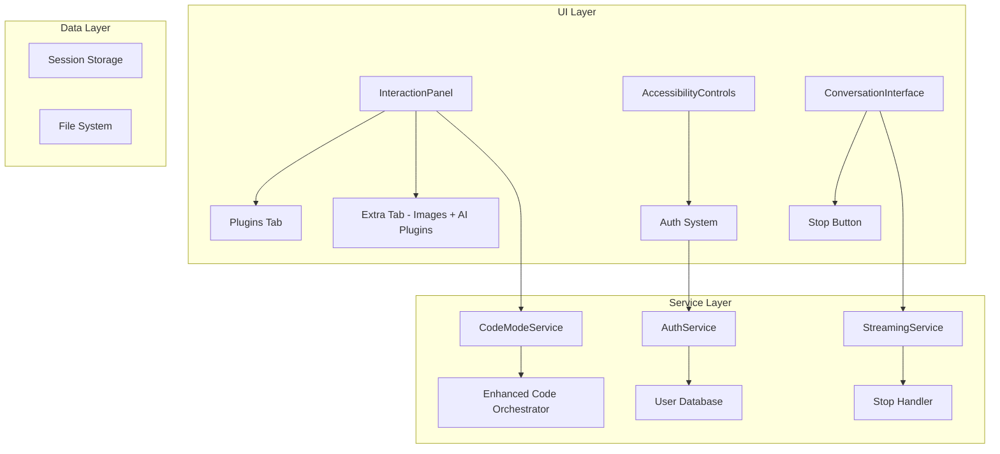

# Design Document

## Overview

This design addresses critical stability and functionality issues in the application through a systematic approach that reorganizes the UI, implements proper authentication, fixes code mode functionality, enables stop button functionality, and resolves TypeScript compilation errors and infinite render loops.

The solution focuses on maintaining existing functionality while improving stability, user experience, and code quality through targeted fixes and enhancements.

## Architecture

### High-Level Architecture



### Component Integration Strategy

The design integrates the existing enhanced-code-orchestrator.ts with the code-mode.tsx component through a unified interface that maintains consistency and safety in code operations while providing enhanced streaming capabilities.

## Components and Interfaces

### 1. UI Reorganization System

**Purpose**: Reorganize plugin interface for better user experience

**Key Components**:
- `InteractionPanel` modification for tab restructuring
- Plugin categorization system
- Tab content migration utilities

**Interface Design**:
```typescript
interface PluginTabConfig {
  id: string;
  name: string;
  plugins: Plugin[];
  categories: string[];
}

interface PluginMigrationService {
  movePluginsToTab(pluginIds: string[], targetTab: string): void;
  renameTab(oldName: string, newName: string): void;
  validateTabStructure(): boolean;
}
```

### 2. Authentication System

**Purpose**: Replace mock authentication with real user registration and persistent login

**Key Components**:
- User registration service
- Email validation system
- Session management
- Database integration

**Interface Design**:
```typescript
interface AuthService {
  register(email: string, password: string): Promise<AuthResult>;
  login(email: string, password: string): Promise<AuthResult>;
  logout(): Promise<void>;
  validateSession(): Promise<boolean>;
  checkEmailExists(email: string): Promise<boolean>;
}

interface AuthResult {
  success: boolean;
  user?: User;
  token?: string;
  error?: string;
}

interface User {
  id: string;
  email: string;
  createdAt: Date;
  lastLogin: Date;
}
```

**Database Schema**:
```sql
CREATE TABLE users (
  id UUID PRIMARY KEY DEFAULT gen_random_uuid(),
  email VARCHAR(255) UNIQUE NOT NULL,
  password_hash VARCHAR(255) NOT NULL,
  created_at TIMESTAMP DEFAULT NOW(),
  last_login TIMESTAMP,
  is_active BOOLEAN DEFAULT true
);

CREATE TABLE user_sessions (
  id UUID PRIMARY KEY DEFAULT gen_random_uuid(),
  user_id UUID REFERENCES users(id) ON DELETE CASCADE,
  token VARCHAR(255) UNIQUE NOT NULL,
  expires_at TIMESTAMP NOT NULL,
  created_at TIMESTAMP DEFAULT NOW()
);
```

### 3. Streaming API System

**Purpose**: Fix streaming response parsing and eliminate duplicate API calls

**Key Components**:
- Streaming response parser with proper error handling
- API call deduplication system
- Chat vs Code mode response routing
- Stream event validation and recovery

**Interface Design**:
```typescript
interface StreamingManager {
  parseStreamResponse(response: ReadableStream): AsyncGenerator<StreamChunk>;
  handleStreamError(error: StreamError): void;
  validateStreamEvent(event: string): boolean;
  recoverFromInvalidEvent(event: string): StreamChunk | null;
}

interface StreamChunk {
  type: 'text' | 'code' | 'error' | 'complete';
  content: string;
  metadata?: Record<string, any>;
}

interface StreamError {
  type: 'parse_error' | 'connection_error' | 'invalid_event';
  message: string;
  recoverable: boolean;
}
```

### 4. Code Mode Integration System

**Purpose**: Fix code mode functionality and prevent duplicate API calls

**Key Components**:
- Code mode request handler with deduplication
- Enhanced orchestrator integration
- Proper session management
- HTTP 400 error prevention

**Interface Design**:
```typescript
interface CodeModeIntegration {
  processCodeRequest(request: CodeRequest): Promise<CodeResponse>;
  preventDuplicateRequests(requestId: string): boolean;
  validateSessionStart(sessionData: any): ValidationResult;
  handleSessionError(error: SessionError): void;
}

interface CodeRequest {
  id: string;
  prompt: string;
  files: ProjectFile[];
  options: CodeModeOptions;
  timestamp: number;
}

interface ValidationResult {
  valid: boolean;
  errors: string[];
  sanitizedData?: any;
}
```

### 5. Mode Separation System

**Purpose**: Ensure proper separation between Chat and Code modes

**Key Components**:
- Mode-aware response routing
- Conditional diff generation
- Code preview panel control
- Input vs response parsing separation

**Interface Design**:
```typescript
interface ModeManager {
  getCurrentMode(): 'chat' | 'code';
  routeResponse(response: string, mode: string): ProcessedResponse;
  shouldGenerateDiffs(response: string, mode: string): boolean;
  shouldOpenCodePreview(response: string, mode: string): boolean;
}

interface ProcessedResponse {
  mode: 'chat' | 'code';
  content: string;
  codeBlocks?: CodeBlock[];
  fileDiffs?: FileDiff[];
  shouldShowDiffs: boolean;
}

interface DiffDetector {
  detectFileDiffs(response: string): FileDiff[];
  isFileEdit(codeBlock: CodeBlock): boolean;
  extractFileOperations(response: string): FileOperation[];
}
```

### 6. Request Deduplication System

**Purpose**: Prevent duplicate API calls and ensure single request processing

**Key Components**:
- Request fingerprinting
- In-flight request tracking
- Timeout-based cleanup
- Error state management

**Interface Design**:
```typescript
interface RequestDeduplicator {
  generateRequestId(request: any): string;
  isRequestInFlight(requestId: string): boolean;
  registerRequest(requestId: string): void;
  completeRequest(requestId: string): void;
  cleanupExpiredRequests(): void;
}

interface RequestState {
  id: string;
  timestamp: number;
  status: 'pending' | 'completed' | 'error';
  abortController?: AbortController;
}
```

### 5. Render Loop Prevention System

**Purpose**: Fix infinite render loops and TypeScript errors

**Key Components**:
- Dependency optimization
- State management fixes
- Effect cleanup handlers
- Performance monitoring

**Interface Design**:
```typescript
interface RenderOptimizer {
  validateDependencies(component: string, deps: any[]): ValidationResult;
  optimizeEffects(effects: EffectConfig[]): EffectConfig[];
  detectRenderLoops(): RenderLoopReport[];
}

interface EffectConfig {
  id: string;
  dependencies: any[];
  cleanup?: () => void;
  skipConditions?: () => boolean;
}
```

## Data Models

### User Management
```typescript
interface UserProfile {
  id: string;
  email: string;
  preferences: UserPreferences;
  subscription: SubscriptionInfo;
}

interface UserPreferences {
  theme: string;
  notifications: boolean;
  autoSave: boolean;
}
```

### Code Mode Session
```typescript
interface CodeModeSession {
  id: string;
  userId?: string;
  files: ProjectFile[];
  status: SessionStatus;
  orchestratorSession?: string;
  createdAt: Date;
  lastActivity: Date;
}
```

### Operation Tracking
```typescript
interface ActiveOperation {
  id: string;
  type: OperationType;
  status: OperationStatus;
  abortController: AbortController;
  metadata: OperationMetadata;
}
```

## Error Handling

### Streaming Response Errors
- Invalid stream event parsing with graceful recovery
- Connection interruption handling
- Malformed JSON event recovery
- Stream timeout and reconnection logic

### API Request Errors
- Duplicate request prevention and handling
- HTTP 400 error root cause analysis and prevention
- Request validation before sending
- Proper error message display without exposing internal errors

### Mode Separation Errors
- Incorrect diff generation prevention
- Code preview panel false triggers
- Cross-mode contamination prevention
- Input parsing vs response parsing separation

### Authentication Errors
- Email validation errors
- Password strength validation
- Database connection errors
- Session expiration handling

### Code Mode Errors
- Session initialization validation
- File processing errors
- Enhanced orchestrator communication failures
- Timeout management

### UI Errors
- Render loop detection and prevention
- Component state corruption recovery
- Event handler cleanup
- Memory leak prevention

## Testing Strategy

### Unit Tests
- Authentication service functions
- Code mode integration logic
- Stop button functionality
- Render optimization utilities

### Integration Tests
- End-to-end authentication flow
- Code mode with orchestrator integration
- UI component interactions
- Database operations

### Performance Tests
- Render loop prevention
- Memory usage monitoring
- Operation cancellation timing
- Streaming performance

### Error Recovery Tests
- Network failure scenarios
- Database unavailability
- Component crash recovery
- Session restoration

## Implementation Phases

### Phase 1: UI Reorganization
1. Modify InteractionPanel component
2. Implement plugin migration
3. Update tab structure
4. Test UI changes

### Phase 2: Authentication System
1. Create database schema
2. Implement auth service
3. Update accessibility controls
4. Add session management

### Phase 3: Code Mode Fixes
1. Fix infinite render loops
2. Integrate enhanced orchestrator
3. Implement proper error handling
4. Add streaming support

### Phase 4: Stop Button Implementation
1. Create operation manager
2. Implement abort controllers
3. Update UI components
4. Add cleanup handlers

### Phase 5: TypeScript and Stability
1. Fix compilation errors
2. Optimize component dependencies
3. Add performance monitoring
4. Implement error boundaries

## Security Considerations

### Authentication Security
- Password hashing with bcrypt
- JWT token management
- Session timeout handling
- CSRF protection

### Data Protection
- Input validation and sanitization
- SQL injection prevention
- XSS protection
- Secure session storage

### Code Execution Safety
- Sandboxed code processing
- File access restrictions
- Resource usage limits
- Error information filtering

## Performance Optimization

### Render Performance
- Memoization of expensive computations
- Proper dependency arrays
- Component splitting
- Lazy loading

### Memory Management
- Cleanup of event listeners
- Abort controller disposal
- Cache size limits
- Garbage collection optimization

### Network Efficiency
- Request deduplication
- Response caching
- Streaming optimization
- Connection pooling