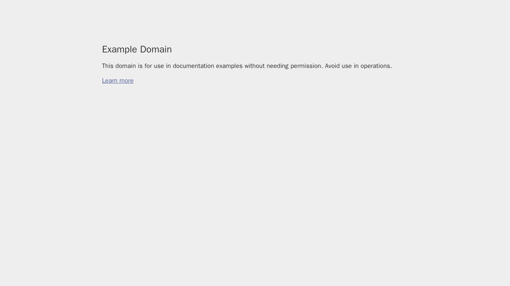

# Playwright Example

Access web pages in headless mode using Playwright + Chromium in OpenSandbox to scrape title/body snippets.

## Build the Playwright Sandbox Image

The Dockerfile in this directory builds a sandbox image with Playwright and Chromium pre-installed:

```shell
cd examples/playwright
docker build -t opensandbox/playwright:latest .
```

This image includes:
- Playwright Python package
- Chromium browser binaries
- Node.js and npm (for Playwright MCP)
- Non-root user (playwright) for security

## Start OpenSandbox server [local]

Pre-pull the Playwright image:

```shell
docker pull sandbox-registry.cn-zhangjiakou.cr.aliyuncs.com/opensandbox/playwright:latest
```

Start the local OpenSandbox server:

```shell
uv pip install opensandbox-server
opensandbox-server init-config ~/.sandbox.toml --example docker
opensandbox-server
```

## Create and Access the Playwright Sandbox

```shell
# Install OpenSandbox package
uv pip install opensandbox

uv run python examples/playwright/main.py
```

The script launches Chromium in headless mode to access the target URL, prints title/body snippets, and saves a full-page screenshot to `/home/playwright/screenshot.png` inside the sandbox. It also downloads the screenshot to the local working directory as `./screenshot.png`. Uses the prebuilt Playwright image by default.



## References
- [Playwright](https://playwright.dev/)
