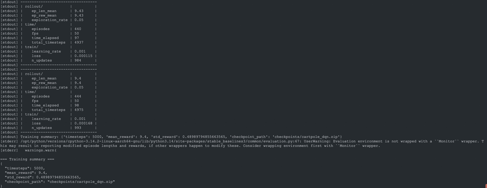

# Reinforcement Learning Sandbox Example

Demonstrates running a basic RL training loop (CartPole + DQN) inside an isolated OpenSandbox container. The example installs RL dependencies in the sandbox, trains a policy, saves a checkpoint, and returns a training summary.

## Start OpenSandbox server [local]

Start the local OpenSandbox server:

```shell
uv pip install opensandbox-server
opensandbox-server init-config ~/.sandbox.toml --example docker
opensandbox-server
```

## Run the Example

```shell
# Install OpenSandbox package
uv pip install opensandbox

# Run the example
uv run python examples/rl-training/main.py
```

The script provisions a sandbox, installs RL dependencies, trains a DQN agent on CartPole, saves a checkpoint, and prints the JSON training summary.



## Environment Variables

- `SANDBOX_DOMAIN`: Sandbox service address (default: `localhost:8080`)
- `SANDBOX_API_KEY`: API key if your server requires authentication
- `SANDBOX_IMAGE`: Docker image to use (default: `sandbox-registry.cn-zhangjiakou.cr.aliyuncs.com/opensandbox/code-interpreter:v1.0.1`)
- `RL_TIMESTEPS`: Training timesteps to run (default: `5000`)

## TensorBoard

The training script logs to `runs/`. To visualize metrics, open a shell in the sandbox and run:

```shell
tensorboard --logdir runs --host 0.0.0.0 --port 6006
```
