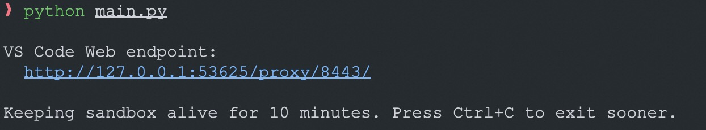
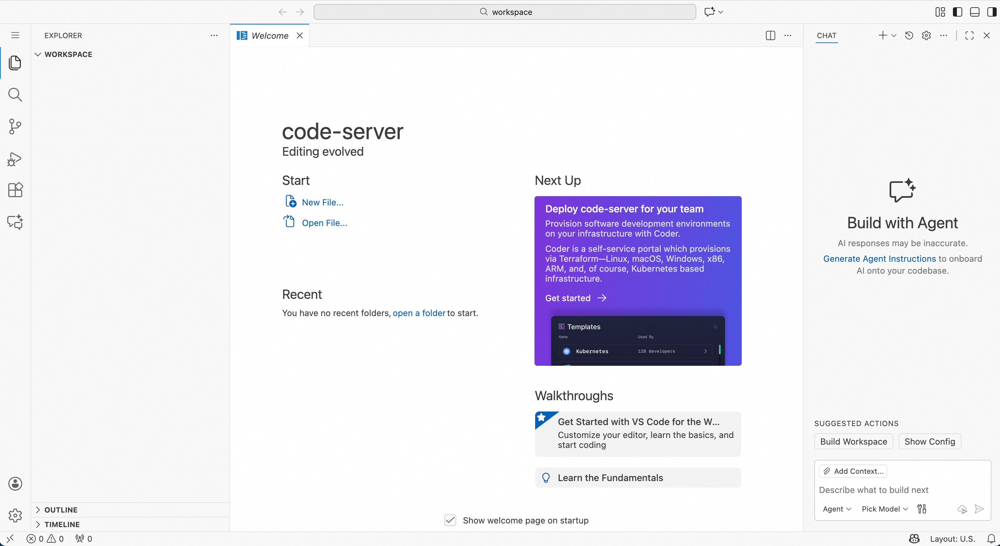

# VS Code Example

## Build the VS Code Sandbox Image

The Dockerfile in this directory builds a sandbox image with code-server pre-installed:

```shell
cd examples/vscode
docker build -t opensandbox/vscode:latest .
```

This image includes:
- code-server (VS Code Web) pre-installed
- Non-root user (vscode) for security
- Workspace directory at `/workspace`

Launch code-server (VS Code Web) in OpenSandbox to provide browser access.

## Start OpenSandbox server [local]

Pre-pull the VS Code image:

```shell
docker pull sandbox-registry.cn-zhangjiakou.cr.aliyuncs.com/opensandbox/vscode:latest
```

Start the local OpenSandbox server:

```shell
uv pip install opensandbox-server
opensandbox-server init-config ~/.sandbox.toml --example docker
opensandbox-server
```

## Create and Access the VS Code Sandbox

```shell
# Install OpenSandbox package
uv pip install opensandbox

uv run python examples/vscode/main.py
```

The script starts code-server (with authentication disabled), binds it to the specified port and outputs the accessible address. Uses the prebuilt VS Code image by default.




## References
- [code-server (VS Code Web)](https://github.com/coder/code-server)
